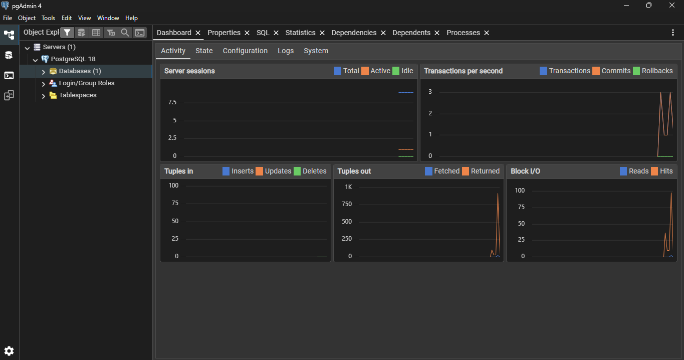
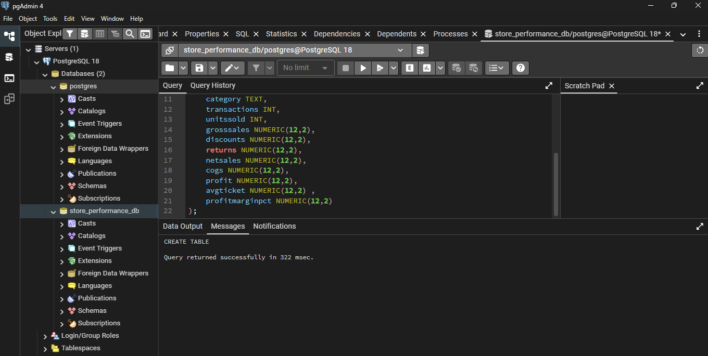

# Learning_PostgreSQL-Python
Connecting Python to SQL databases | Writing SQL queries for analysis | Cleaning and transforming data with Pandas | Analyzing store and business performance | Creating insights, reports, and visualizations.. Ref ; Real Data Analyst Projects (Python + SQL Step-by-Step)  by Data Geek is my name

## Install PostgreSQL on Windows

1. download and install using the official site
https://www.enterprisedb.com/downloads/postgres-postgresql-downloads 
2. give a password when asked (note it somewhere safe)
3. install pgAdmin 4 (optional, for GUI-based interaction with database)



## Create a PostgreSQL database and Connect to python.

### 1. Create a new database in pgAdmin
    - Servers> Databases(right click on Databases)> Create> Database (here the database name is store_performance_db)>save
    - store_performance_db > schemas > public > Tables (right click on Tables)
### 2. Create a table using SQL
    - select the database > click on tools on nav bar > select Query tool.
    - Now type and run the SQL query
    
### 3. Connect to PostgreSQL using Python
    - **Option A: Jupyter Notebook**
        - A Jupyter Notebook `database_analysis.ipynb` has been created.
        - Required libraries: `pip install psycopg2-binary pandas jupyter sqlalchemy`
        - Open the file and run the cells.
    - **Option B: Python Script**
        - A standard Python script `database_analysis.py` has been created.
        - Required libraries: `pip install psycopg2-binary pandas sqlalchemy`
        - Run it using: `python database_analysis.py`
        - It handles the connection and prints the PostgreSQL version to confirm success.
        - Code segment:
          ```python
          import pandas as pd
          from sqlalchemy import create_engine, text

          USERNAME = "postgres"
          PASSWORD = "YOUR_PASSWORD"
          HOST = "localhost"
          PORT = "5432"
          DB_NAME = "store_performance_db"

          engine = create_engine(f"postgresql+psycopg2://{USERNAME}:{PASSWORD}@{HOST}:{PORT}/{DB_NAME}")
          ```

## SQL Queries

| SQL query | Purpose |
|-----------|---------|
| `SELECT * FROM table_name;` | Display all columns and rows from a table. |
| `SELECT column1, column2 FROM table_name;` | Display specific columns from a table. |
| `SELECT * FROM table_name WHERE condition;` | Filter rows based on a condition. |
| `SELECT * FROM table_name ORDER BY column_name DESC/ASC;` | Sort results by a column in descending or ascending order. |
| `SELECT column1, COUNT(*) FROM table_name GROUP BY column1;` | Count occurrences of each value in a column. |
| `SELECT column1, SUM(column2) FROM table_name GROUP BY column1;` | Calculate sum of a column for each value in another column. |
| `SELECT * FROM table_name LIMIT 10;` | Display only the first 10 rows. |
| `SELECT * FROM table1 JOIN table2 ON table1.column = table2.column;` | Combine rows from two tables based on a related column. |
| `CREATE TABLE table_name (column1 datatype, column2 datatype);` | Create a new table. |
| `INSERT INTO table_name (column1, column2) VALUES (value1, value2);` | Insert a new row into a table. |
| `UPDATE table_name SET column1 = value1 WHERE condition;` | Update existing rows in a table. |
| `DELETE FROM table_name WHERE condition;` | Delete rows from a table. |


## Upload CSV to PostgreSQL using Python

Loaded a CSV file into Pandas, formatted the date column, and uploaded the data to PostgreSQL.

### 1. Read CSV and Format Date
```python
# Read the CSV file
store_df = pd.read_csv("store_performance_dataset.csv")

# Format the Date column
try:
    store_df['Date'] = pd.to_datetime(store_df['Date'])
    store_df['Date'] = store_df['Date'].dt.strftime('%Y-%m-%d')
except Exception as e:
    print("Error formatting date column:", e)
```

### 2. Upload to Database
```python
# Uploading the data into the database
store_df.to_sql("store_sales", engine, if_exists="replace", index=False)
print("Data uploaded to PostgreSQL successfully!")
```

### 3. Verify the Upload
```python
# Check the connection and row count
with engine.connect() as conn:
    count = conn.execute(text("SELECT COUNT(*) FROM store_sales;"))
    print("Number of rows in the table:", count.fetchone()[0])
```

## Restructuring the project files

To improve modularity and code organization, the project logic has been restructured into multiple dedicated Python scripts:

- **`connection.py`**: Centralizes the database connection credentials and configuration, creating the SQLAlchemy `engine` used by other scripts.
- **`checkConnection.py`**: Contains utility functions like `check_entire_table()` to quickly verify database connectivity and output row counts.
- **`databaseCreation.py`**: Handles reading the raw CSV, formatting the date column appropriately, and uploading the `store_performance_dataset.csv` data to the PostgreSQL database.
- **`analyze.py`**: A dedicated script that performs data analysis on the data queried directly from the PostgreSQL database.

## Data Analysis

The `analyze.py` script utilizes Pandas and SQLAlchemy to execute analysis directly against the PostgreSQL `store_sales` table. Current analysis includes:

- **Top Performing Stores**: Groups by `StoreName` to find the store generating the highest overall net sales.
- **Sales by Region**: Aggregates `NetSales` across different regions to identify the highest revenue-generating areas.
- **Revenue by Day of the Week**: Computes the total revenue on each day to pinpoint the busiest and most profitable shopping days.

You can run the analysis by executing:
```bash
python analyze.py
```

## Setup & Configuration

- A `.gitignore` file has been added to exclude common Python and environment files (like virtual environments and `__pycache__`) from version control.
